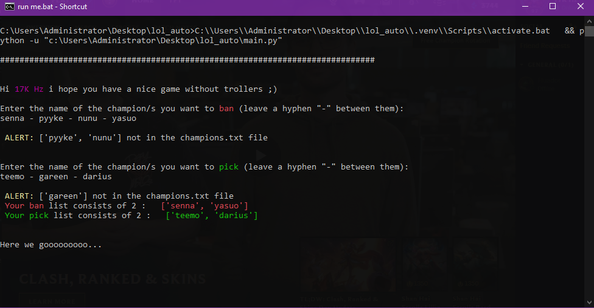

# LOL-matchmaking-copilot

this script accepts matches , bans and picks champs for you so you don't have to pay attention for the game before it starts – in other words, this script is your best friend solo low elo player :broken_heart:

### installing dependencies
```
pip install -r requirements.txt
```
### How to run ?
```
python -u main.py
```
### Screenshot sample for the script running


### TODO
- don't ban a champ if a teammate selected it
- choosing the rune page for every champ the user picks (rune pages that the user have already set up on his account)
- choosing the spells for every champ too
- a notification sent to the mobile when the match starts (ik this is too much :joy:)


## Notes
- This script has been designed in accordance with the game rules and does not violate any of them (idk if the auto ban thing is wrong but the script is fine to run)
- You can customize your champion name by editing champids.txt file and duplicating the champ id you want but with another name (or u can just change the name u find inside)
  


